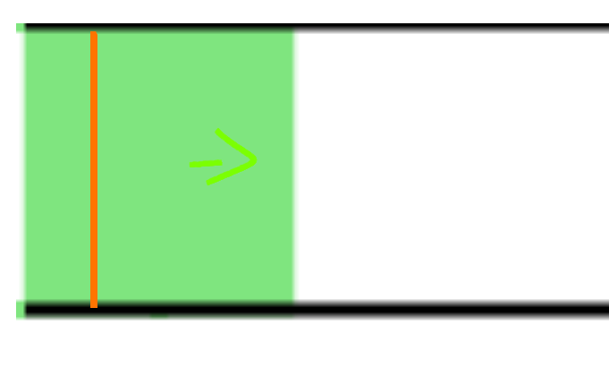

## General
- everything should have a unique ID, Int is probably easiest to use
- if you need to communicate with an object (e.g. a Sensor to get its data) you need to store that ID to access the object
- if you can do it, you should add the containing layers ID to each Advanced Component (only if it's easy)
- we need to use vertical layers as well
- controlling the simulation will be your job. I will add a howto in the end, for now WIP
- if there are already other ways to convey the information you can ofc use that
- (x) in the end means its an attribute of type x I need from the you
- (vec) means x,y coordinates
## Basic Components
**Horizonal Layer**
- height (depth if vertical) (float)
- contains all of its objects

**Vertical Channel** (similar to a layer)
- WIP (maybe use horizontal layer with vertical (bool) attribute)
- containing objects (only lines and layerchanges)

**Layerchange**
- WIP
- is a circle
- center (vec)
- radius (float)
- connected Layerchange ID (int)

  
**Line**
- starting position (vec)
- ending position (vec)
- lines or arcs directly connected IDs (int)
  
**Arc**
- center of containing circle (vec)
- starting position/starting angle in radians (vec/float)
- ending position/ending angle in radians (vec/float)
- radius when using angles (float)
- arc goes clockwise from start to end  
- lines or arcs directly connected IDs (int)

  
## Advanced Components
**Sensor**
- sensors extend lines, so they need their attributes as well
- you need to tell me what it should measure (speed, pressure or both)
- sampling interval in amount of steps of multiples of 1/60 seconds (int)
  
**Inlet**
- is a rectangle
- width (vec)
- height (vec)
- center (vec)
- normalized direction in which fluid should flow (vec)
- speed/pressure (bool)
- target pressure/speed (float)
- coordinates of the summoning line (2x vec) maybe not necessary

    
  
  red line is where particles are spawned, yellow arrow is the direction the< are pushed
- information about the inserted fluid

**Valve**
- extends line
- connected gate ID (int)
- sampling interval in amount of steps of multiples of 1/60 seconds (int)
- pressure threshold at which the gate closes
- should the gate push particles aside? (bool) most likely always true

**Gate**
- extends line
- can open/close
- most likely on another layer

## Controlling the Simulation (WIP)
- you will get an object that represents the engine
- every time you want to simulate a new timeframe you have to call engine.step(). This will progress the simulation by 1/60th of a second
- to get a sensor -> engine.getSensor(sensorID)
- to get the sensors data -> sensor.GetAvgPressure()/GetAvgSpeed()
- to get an inlet -> engine.getInlet(inletId)
- inlets can 
  - -> Activate()
  - -> Deactivate()